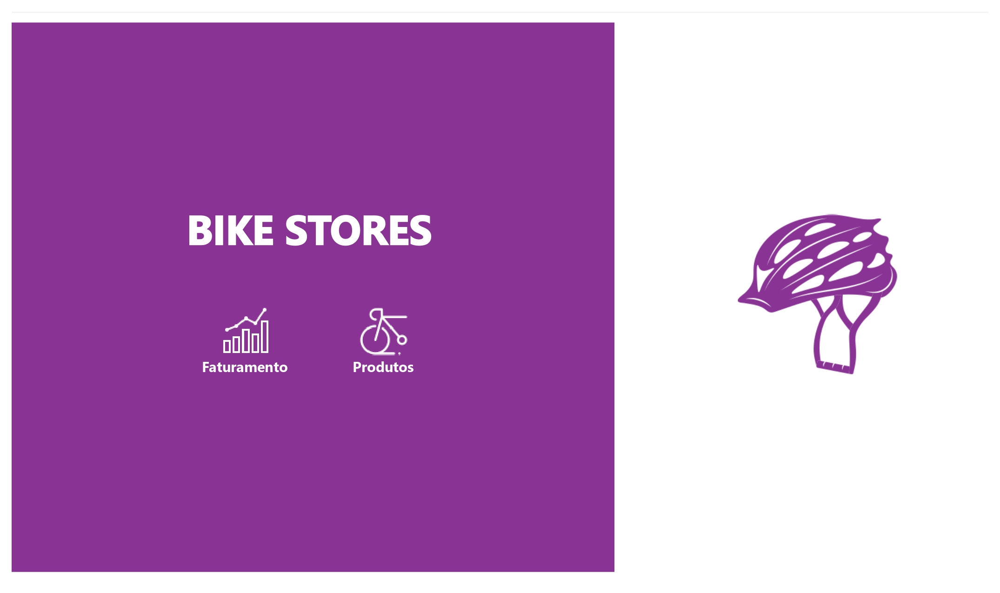
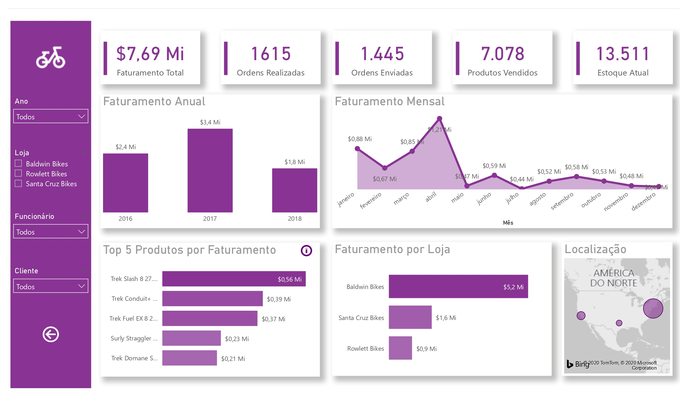
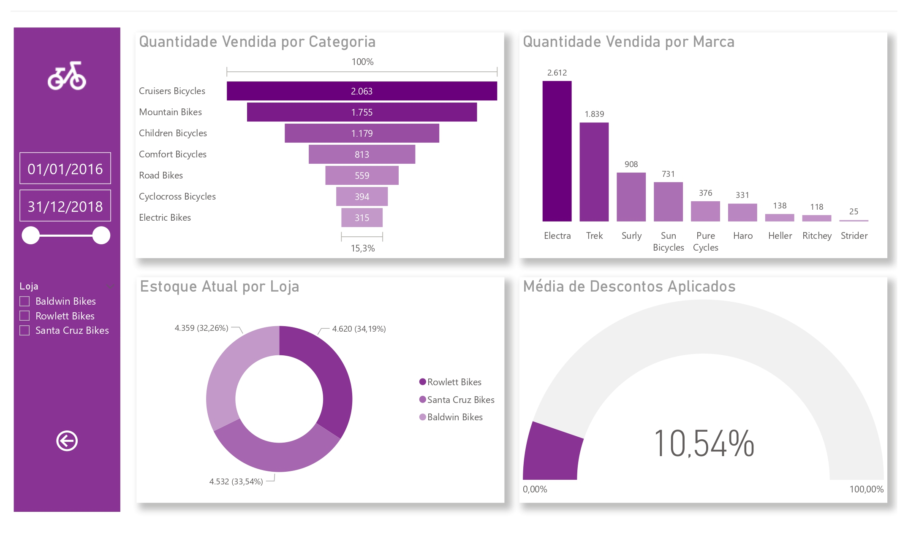
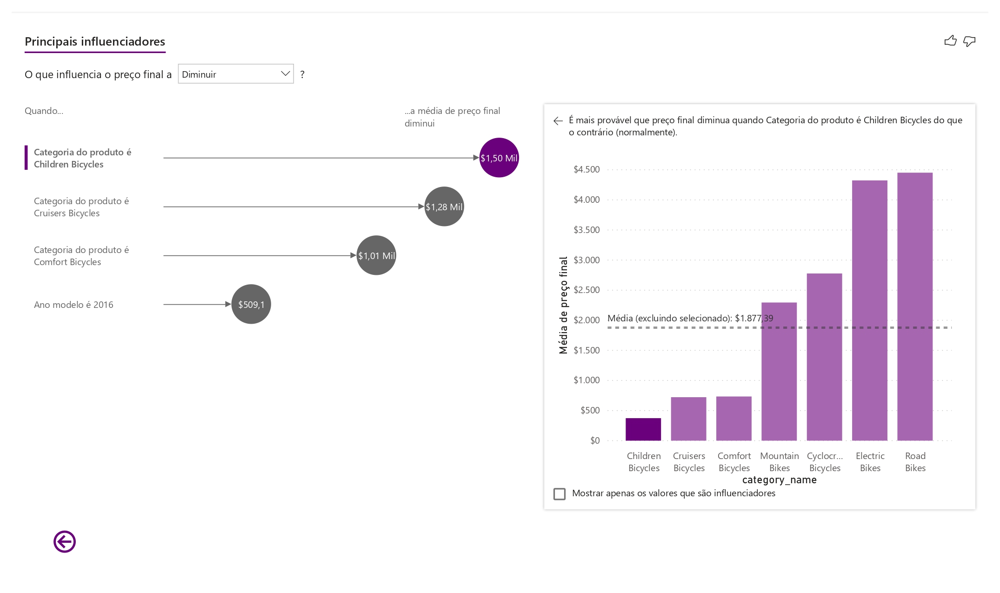
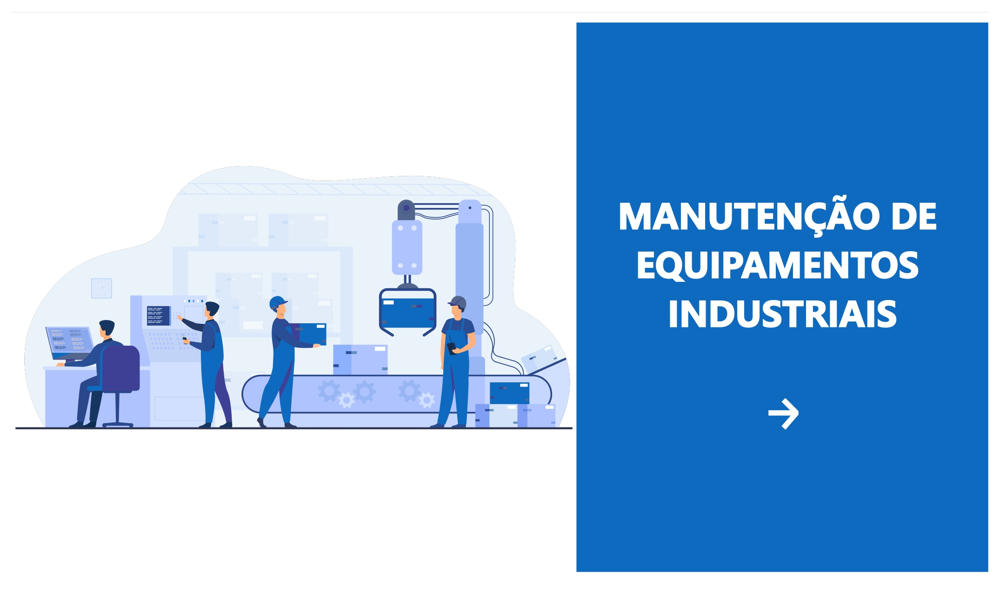
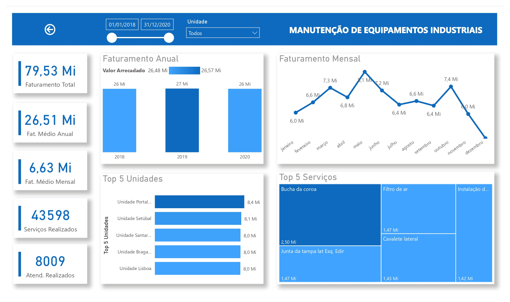

  <h1>Dashboards Power BI</h1>

 

### BikeStores

Acessar relatório: <a href="https://app.powerbi.com/view?r=eyJrIjoiMWVlNzRjNmUtZWZmYy00ZDMyLWFkNzctZmM2MmNmZDg1OGFlIiwidCI6IjkyNzQyZWFlLWExMTktNDNmYi1hOTU2LWQ3ZGVmNzQ0ODgxYSIsImMiOjh9&pageName=ReportSection">BikeStores</a>

O relatório desenvolvido contém três páginas, a capa, a página de faturamento e a página de produtos.

Na capa foram inseridos dois botões com o intuito de facilitar a navegção entre os dashboars.

 

  

 

Na página de faturamento foram inseridos os itens:
  * Slicer: Foram adicionados 4 slicers onde é possível realizar filtros por ano, loja, faturamento e cliente.
  * Gráfico de colunas empilhadas: Faturamento anual das lojas.
  * Gráfico de área: Faturamento mensal das lojas.
  * Gráfico de barras empilhadas: Maiores faturamentos por produto e por loja.
  * Mapa: Localização das lojas onde o tamanho das bolhas é classificado de acordo com o faturamento total de cada loja.
  * Cartão: Foram adicionados 5 cartões com informações de faturamento, ordens realizadas e enviadas, produtos vendidoes e estoque atual.

 

  

 
  
Na página de produtos foram inseridos os itens:
  * Slicer: Foram adicionados 2 slicers onde é possível realizar filtros por ano e loja.
  * Funil: Quantidade vendida por categoria de produto.
  * Gráfico de colunas empilhadas: Quantidade vendida por marca de produto.
  * Gráfico de Rosca: Estoque atual em cada uma das lojas.
  * Indicador: Indica a média atual dos descontos aplicados em percentagem.

 

  

 

Foi criada ainda uma quarta página onde há análise referente aos principais influenciadores que fazem o preço aumentar ou diminuir. O acesso a essa página é feito através do botão de informação contido na página de faturamento no item “TOP 5 Produtos por faturamento”.

 

  

 

_________________

 

### Manutenção de Equipamentos Industriais

Acessar relatório: <a href="https://app.powerbi.com/view?r=eyJrIjoiYzA3MWE5MTEtMDFiMS00ZjJlLTljNjItMjY4ZDY4ZWI4YjllIiwidCI6IjkyNzQyZWFlLWExMTktNDNmYi1hOTU2LWQ3ZGVmNzQ0ODgxYSIsImMiOjh9&pageName=ReportSection7762183af277fdd49fa2">Manutenção de Equipamentos Industriais</a>.

Com o objetivo de complementar a pratica de criação de medidas, foi elaborado mum relatório de BI com a base dados desenvolvida pelo autor, disponível no repositório <a href="https://github.com/viniciusariza/bd-equip-industriais">bd-equip-industriais</a>.
Importante ressaltar que, como os dados não representam a realidade e foram obtidos aleatóriamente, o relatório não permite a realização de análises reais.

 

  

 

  

